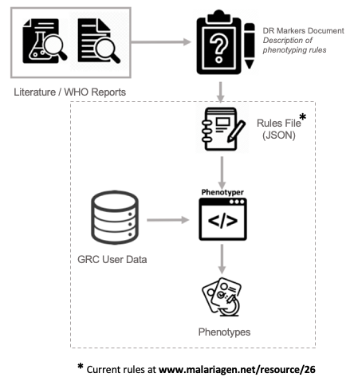

# Phenotyper

Phenotyper is a tool to infer drug resistance status from genetic data alone. It works by evaluating a set of rules on a collection of genetic markers (e.g. genotypes associated with drug resistance in *P. falciparum)*. The inputs required are: i) a tabular data file with information on genotypes and, ii) a JSON configuration file encoding a set of phenotyping rules. 





We have curated a set of rules from the literature and official reports that relate drug resistance markers to resistance status (see www.malariagen.net/resource/26 for the current set of rules). Nonetheless, users can provide their own rules or modify the ones provided according to their needs.

### Installation

Phenotyper is a single R script that can be run as a command-line tool in any machine where R and the required packages are installed. To download and install R please visit https://cloud.r-project.org/. Once R has been installed in your system, you'll need to install the following packages: `jsonlite`, `stringr`, and `optparse`. To do this, just open R from the terminal and run the following line.

```
install.packages(c('jsonlite', 'stringr', 'optparse'))
```

If you need more assistance the package installation, please visit https://www.r-bloggers.com/2013/01/how-to-install-packages-on-r-screenshots/ which provides a step-by-step tutorial with screenshots.

Once R and the required libraries have been installed, you need to download the script `phenotyper.R`.

If you are using windows, please visit http://datacornering.com/how-to-run-r-scripts-from-the-windows-command-line-cmd/ for guidance.


### Running phenotyper

You can run phenotyper from the command line by typing `./phenotyper.R` accompanied by the following options:  


```
Usage: ./phenotyper.r [options]
Evaluates a set of phenotyping rules on all the samples of the given data/genotypes file.

Options:
        --datafile=DATAFILE
                Path to the data/genotypes file, a tabular file with the required columns (by default we expect the first column to be sample names).

        --rulesfile=RULESFILE
                Path to the JSON file that encodes the rules to be used for evaluating each drug phenotype.

        --ruleout=RULEOUT
                The field to be extracted from a rule when it evaluates to `True`.

        --samplecolumn=SAMPLECOLUMN
                The name of the column in the data file that designates the sample id (optional). If not provided, we assume the first column provides sample names.

        --verbose
                A flag to obtain verbose detailed output in the standard output (warning: can generate very big logs, useful for debugging).

        --output=OUTPUT
                Path for the output file. This file will have a row per sample and a column per drug/phenotype evaluated.

        -h, --help
                Show this help message and exit
```

If you need help at any point, `./phenotyper.R --help` reproduces the output above. 

An example run of phenotyper would look like: 

```
./phenotyper --datafile genotypes.tab --rulesfile pf6_rules.json --ruleout phenotype --samplecolumn sample
```

where each parameter has the following meaning:

- `--datafile genotypes.tab` , this is the input file with genotypes/markers in tabular format (cells separated by tabs).
- `--rulesfile pf6_rules.json`, the JSON configuration file that contains the phenotyping rules to be evaluated on the input data.
- `--ruleout phenotype`, the field to be returned as output from a rule when it evaluates to `True` (see the rules section for details).
- `--samplecolumn sample`, the column of the input data that contains the sample name or id. If not provided, the first column is assumed to contain sample ids.
- `--output phenotypes.tab`, the path to the output tabular file with the inferred phenotypes.


### Phenotyping Rules

Drugs are evaluated according to a set of rules specified in a JSON document. The document contains an object per drug with the following structure

``` {
{
   "drugs":{
      "Chloroquine":{
         "rules":[
            {
               "name":"Chloroquine-1",              
               "evaluation":"`crt_76[K]` %contains% ','",
               "phenotype":"Resistant/het",
               ...
            },
            {
               "name":"Chloroquine-2",
               ...
            },
            ... (more rules)
            {
               "name":"Chloroquine-N",
               ...
            }           
         ]
      },
      "Artemisinin":{
         "rules":[
            {
               "name":"Artemisinin-1",               
               "evaluation":"`k13_class` %==% 'MI'",
               "phenotype":"Undetermined/missing",
               ...
            },
            ... (more rules)
            {
               "name":"Artemisinin-N",
               ...
            }
					]
      },
      ... (other drugs)
   }
}
```


Each drug contains an array of rules that will be executed sequentially (from top to bottom). The only mandatory fields for a rule are `name` and `evaluation`. Within `evaluation` one can access any of the columns provided in the input data file using an R valid expression. **Notice we protect the name of any column with backticks** (e.g. `` "evaluation":"`crt_76[K]` %contains% ','"``) to avoid conflict with special characters when R access the data. If such expression evaluates to `True`, the interpreter will assign the phenotype provided in the designated ``--ruleout`` field (which by convention is called `phenotype`). Additional fields can be added to the rules, as a form of documentation or to allow different outputs on the same set of rules. 

For most use cases, the last rule in a set should be a default rule that will be activated if none of the previous rules evaluated to `True` (this is not mandatory but it is strongly adviced, unless it is clear that the defined rules cover all possible cases). This is achieved by setting the evaluation field to `True` (i.e. ``"evaluation":"T"``). As an example, below we show a set of rules for inferring resistance status to chloroquine.


```
"Chloroquine":{
         "rules":[
            {
               "name":"Chloroquine-1",
               "change":"76-Het",
               "evaluation":"`crt_76[K]` %contains% ','",
               "interpretation":"Het",
               "phenotype":"Resistant/het",
               "analytics":"Resistant"
            },
            {
               "name":"Chloroquine-2",
               "change":"76-Missing",
               "evaluation":"`crt_76[K]` %==% '-'",
               "interpretation":"Missing",
               "phenotype":"Undetermined/missing",
               "analytics":"Undetermined"
            },
            {
               "name":"Chloroquine-3",
               "change":"K76",
               "evaluation":"`crt_76[K]` %==% 'K'",
               "interpretation":"WT",
               "phenotype":"Sensitive",
               "analytics":"Sensitive"
            },
            {
               "name":"Chloroquine-4",
               "change":"76T",
               "evaluation":"`crt_76[K]` %==% 'T'",
               "interpretation":"Mutant",
               "phenotype":"Resistant [1]",
               "analytics":"Resistant"
            },
            {
               "name":"Chloroquine-5",
               "change":"76-nonT",
               "evaluation":"T",
               "interpretation":"Unknown mutant",
               "phenotype":"Undetermined/unknown",
               "analytics":"Undetermined"
            }
         ]
      }
```


#### Evaluation of rules

Phenotyper assesses a rule by evaluating the interpretable R code given in the `evaluation` field. This process allows for flexibility when working with changeable format encodings (e.g. how the hets or missing calls are represented). However, this could be an entry point for malicious code to be injected into the application. We have put in place some safety measures to stop any kind of code infections from happening but, nonetheless, **you should only use JSON configuration files from trusted sources**. In the future, once a consensus formatting/encoding standard has been established for input files, phenotyper will likely adopt a restricted grammar for specifying rules logic.

As mentioned before, a rule can specify any valid R logical expression. To ease the evaluation of rules, we have defined two operators.

1. `%==%`, which represents a loose equality or, more technically, a symmetric `any` operation as in `a %==% b = any(a in b) || any(b in a)`

2. `%contains%` which is an operator that checks if a substring is contained in another string. If the operands are vectors, `a %contains% b` returns `True` if at least one element of `b` is contained in an element of `a`. 

   

#### Referencing other rules

A rule can check the phenotype status of several drugs, for instance to infer multi-drug resistance phenotypes. To do this, we need to surround the name of the drug we are interested in with @ (as in `@Chloroquine@`), for example

```
           {
               "name":"Dihydroartemisinin-piperaquine-3",
               "change":"Missing",
               "evaluation":"@Artemisinin@ %contains% 'Missing' || @Piperaquine@ %contains% 'Missing'",
               "interpretation":"Undetermined/Missing",
               "phenotype":"Missing",
               "analytics":"Undetermined"
            },
```

Bear in mind that circular references will terminate the execution of the program.


### Things to remember when using phenotyper

1. It is advisable to protect column names with backticks (`) in the JSON file as you'll likely find weird characters (for instance if they come from Excel files) that could cause havoc in R. 
2. One can run the program in `--verbose` mode to access the execution log. Notice that the output can be huge (and the execution very slow), but it can be useful to trace back which rules were executed and why.
3. The script will evaluate each rule according to the mandatory `evaluation` field.
4. For each drug, the defined set of rules are executed sequentially, which means that **order is important** (top-down execution until finding one that evaluates to `True`).
5. It is strongly recommended to ensure a default rule has been specified at the end of the rules. If the previous rules don't cover all possible cases, this is mandatory. The rule will be executed if nothing else has been evaluated to `True`. A default rule just evaluates to `True` or `T`. See example below.

```
           {
               "name":"Chloroquine-5",
               "change":"76-nonT",
               "evaluation":"T",
               "interpretation":"Unknown mutant",
               "phenotype":"Undetermined/unknown",
               "analytics":"Undetermined"
            }
```
6. The output file obtained from the rules that evaluate to `True` must be specified using the `--ruleout` option. This allows for different outputs even when working with the same set of rules. For instance, using `--ruleout het_phenotype` instead of `--ruleout phenotype` will provide different phenotypes in the presence of hets. See example below.

``` "Chloroquine":{
         "rules":[
            {
               "name":"Chloroquine-1",
               "change":"76-Het",
               "evaluation":"`PfCRT:76` %==% 'K/T' || `PfCRT:76` %==% 'I/T'",
               "het_phenotype":"Resistant",
               "phenotype":"Undetermined",
               "analytics":"Resistant/Het"
            }, (...)
```

7. Field names and values are always wrapped in quotes (e.g.`"name"`) whereas strings use, by convention, single quotes (e.g.`'K/T'`). Again, column names (referencing the input data file) should be wrapped in backticks. See example above.
8. Trying to access a column that is not present in the input data will produce an error.


### A minimal example

Let's assume we are interested in inferring the resistance status of a set of samples for chloroquine and mefloquine. For chloroquine we check the amino acid at codon 76 (the column in the input data will be called `crt_76[K]` ), whereas for mefloquine we check the presence or absence of a CNV (the column in the input data will be called `dup_mdr1`) The contents of the JSON rules configuration file are shown below.

```
{
   "drugs":{
      "Chloroquine":{
         "rules":[
            {
               "name":"Chloroquine-1",
               "evaluation":"`crt_76[K]` %contains% ','",
               "phenotype":"Resistant"
            },
            {
               "name":"Chloroquine-2",
               "evaluation":"`crt_76[K]` %==% '-'",
               "phenotype":"Undetermined"
            },
            {
               "name":"Chloroquine-3",
               "evaluation":"`crt_76[K]` %==% 'K'",
               "phenotype":"Sensitive"
            },
            {
               "name":"Chloroquine-4",
               "evaluation":"`crt_76[K]` %==% 'T'",
               "phenotype":"Resistant"
            },
            {
               "name":"Chloroquine-5",
               "evaluation":"T",
               "phenotype":"Undetermined"
            }
         ]
      },
      "Mefloquine":{
         "rules":[
            {
               "name":"Mefloquine-1",
               "evaluation":"`dup_mdr1` %==% -1",
               "phenotype":"Undetermined"
            },
            {
               "name":"Mefloquine-2",
               "evaluation":"`dup_mdr1` %==% 0",
               "phenotype":"Sensitive"
            },
            {
               "name":"Mefloquine-3",
               "evaluation":"`dup_mdr1` %==% 1",
               "phenotype":"Resistant"
            }
         ]
      }
   }
}
```


Our example with dummy data for 10 samples would look like the following (tab separate fields).

```
sample	crt_76[K]	dup_mdr1
s01	-	1
s02	K	1
s03	-	-1
s04	K	1
s05	-	0
s06	T	-1
s07	T	-1
s08	-	0
s09	-	0
s10	K	-1
```


Assuming the JSON rules file is called `test-rules.json` and the data file `test-data.tab` we can run phenotyper with the following command

```
./phenotyper.r --datafile test-data.tab --rulesfile test-rules.json --ruleout phenotype --samplecolumn sample --output test-phenotypes.tab --verbose
```


Which will log the following execution information to the standard output.

```
Parsing rules file: test-rules.json
Loading data file: test-data.tab
Applying rules, this may take a while...

Processing SAMPLE: s01

10% done...
Elapsed time: 0.001 secs
Estimated remaining time: 0.01 secs
Evaluating DRUG : Chloroquine...
Executing rule: Chloroquine-1 {`crt_76[K]` %contains% ','}...
No references to other drugs found....
Protected rule: `crt_76[K]` %contains% ','
Result: FALSE
Executing rule: Chloroquine-2 {`crt_76[K]` %==% '-'}...
No references to other drugs found....
Protected rule: `crt_76[K]` %==% '-'
Result: TRUE
Evaluating DRUG : Mefloquine...
Executing rule: Mefloquine-1 {`dup_mdr1` %==% -1}...
No references to other drugs found....
Protected rule: `dup_mdr1` %==% -1
Result: FALSE
Executing rule: Mefloquine-2 {`dup_mdr1` %==% 0}...
No references to other drugs found....
Protected rule: `dup_mdr1` %==% 0
Result: FALSE
Executing rule: Mefloquine-3 {`dup_mdr1` %==% 1}...
No references to other drugs found....
Protected rule: `dup_mdr1` %==% 1
Result: TRUE

Processing SAMPLE: s02

20% done...
Elapsed time: 0.063 secs
Estimated remaining time: 0.25 secs
Evaluating DRUG : Chloroquine...
Executing rule: Chloroquine-1 {`crt_76[K]` %contains% ','}...
No references to other drugs found....
Protected rule: `crt_76[K]` %contains% ','
Result: FALSE
Executing rule: Chloroquine-2 {`crt_76[K]` %==% '-'}...
No references to other drugs found....
Protected rule: `crt_76[K]` %==% '-'
Result: FALSE
Executing rule: Chloroquine-3 {`crt_76[K]` %==% 'K'}...
No references to other drugs found....
Protected rule: `crt_76[K]` %==% 'K'
Result: TRUE
Evaluating DRUG : Mefloquine...
Executing rule: Mefloquine-1 {`dup_mdr1` %==% -1}...
No references to other drugs found....
Protected rule: `dup_mdr1` %==% -1
Result: FALSE
Executing rule: Mefloquine-2 {`dup_mdr1` %==% 0}...
No references to other drugs found....
Protected rule: `dup_mdr1` %==% 0
Result: FALSE
Executing rule: Mefloquine-3 {`dup_mdr1` %==% 1}...
No references to other drugs found....
Protected rule: `dup_mdr1` %==% 1
Result: TRUE

Processing SAMPLE: s03

30% done...
Elapsed time: 0.088 secs
Estimated remaining time: 0.21 secs
Evaluating DRUG : Chloroquine...
Executing rule: Chloroquine-1 {`crt_76[K]` %contains% ','}...
No references to other drugs found....
Protected rule: `crt_76[K]` %contains% ','
Result: FALSE
Executing rule: Chloroquine-2 {`crt_76[K]` %==% '-'}...
No references to other drugs found....
Protected rule: `crt_76[K]` %==% '-'
Result: TRUE
Evaluating DRUG : Mefloquine...
Executing rule: Mefloquine-1 {`dup_mdr1` %==% -1}...
No references to other drugs found....
Protected rule: `dup_mdr1` %==% -1
Result: TRUE

Processing SAMPLE: s04

40% done...
Elapsed time: 0.139 secs
Estimated remaining time: 0.21 secs
Evaluating DRUG : Chloroquine...
Executing rule: Chloroquine-1 {`crt_76[K]` %contains% ','}...
No references to other drugs found....
Protected rule: `crt_76[K]` %contains% ','
Result: FALSE
Executing rule: Chloroquine-2 {`crt_76[K]` %==% '-'}...
No references to other drugs found....
Protected rule: `crt_76[K]` %==% '-'
Result: FALSE
Executing rule: Chloroquine-3 {`crt_76[K]` %==% 'K'}...
No references to other drugs found....
Protected rule: `crt_76[K]` %==% 'K'
Result: TRUE
Evaluating DRUG : Mefloquine...
Executing rule: Mefloquine-1 {`dup_mdr1` %==% -1}...
No references to other drugs found....
Protected rule: `dup_mdr1` %==% -1
Result: FALSE
Executing rule: Mefloquine-2 {`dup_mdr1` %==% 0}...
No references to other drugs found....
Protected rule: `dup_mdr1` %==% 0
Result: FALSE
Executing rule: Mefloquine-3 {`dup_mdr1` %==% 1}...
No references to other drugs found....
Protected rule: `dup_mdr1` %==% 1
Result: TRUE

Processing SAMPLE: s05

50% done...
Elapsed time: 0.189 secs
Estimated remaining time: 0.19 secs
Evaluating DRUG : Chloroquine...
Executing rule: Chloroquine-1 {`crt_76[K]` %contains% ','}...
No references to other drugs found....
Protected rule: `crt_76[K]` %contains% ','
Result: FALSE
Executing rule: Chloroquine-2 {`crt_76[K]` %==% '-'}...
No references to other drugs found....
Protected rule: `crt_76[K]` %==% '-'
Result: TRUE
Evaluating DRUG : Mefloquine...
Executing rule: Mefloquine-1 {`dup_mdr1` %==% -1}...
No references to other drugs found....
Protected rule: `dup_mdr1` %==% -1
Result: FALSE
Executing rule: Mefloquine-2 {`dup_mdr1` %==% 0}...
No references to other drugs found....
Protected rule: `dup_mdr1` %==% 0
Result: TRUE

Processing SAMPLE: s06

60% done...
Elapsed time: 0.191 secs
Estimated remaining time: 0.13 secs
Evaluating DRUG : Chloroquine...
Executing rule: Chloroquine-1 {`crt_76[K]` %contains% ','}...
No references to other drugs found....
Protected rule: `crt_76[K]` %contains% ','
Result: FALSE
Executing rule: Chloroquine-2 {`crt_76[K]` %==% '-'}...
No references to other drugs found....
Protected rule: `crt_76[K]` %==% '-'
Result: FALSE
Executing rule: Chloroquine-3 {`crt_76[K]` %==% 'K'}...
No references to other drugs found....
Protected rule: `crt_76[K]` %==% 'K'
Result: FALSE
Executing rule: Chloroquine-4 {`crt_76[K]` %==% 'T'}...
No references to other drugs found....
Protected rule: `crt_76[K]` %==% 'T'
Result: TRUE
Evaluating DRUG : Mefloquine...
Executing rule: Mefloquine-1 {`dup_mdr1` %==% -1}...
No references to other drugs found....
Protected rule: `dup_mdr1` %==% -1
Result: TRUE

Processing SAMPLE: s07

70% done...
Elapsed time: 0.242 secs
Estimated remaining time: 0.1 secs
Evaluating DRUG : Chloroquine...
Executing rule: Chloroquine-1 {`crt_76[K]` %contains% ','}...
No references to other drugs found....
Protected rule: `crt_76[K]` %contains% ','
Result: FALSE
Executing rule: Chloroquine-2 {`crt_76[K]` %==% '-'}...
No references to other drugs found....
Protected rule: `crt_76[K]` %==% '-'
Result: FALSE
Executing rule: Chloroquine-3 {`crt_76[K]` %==% 'K'}...
No references to other drugs found....
Protected rule: `crt_76[K]` %==% 'K'
Result: FALSE
Executing rule: Chloroquine-4 {`crt_76[K]` %==% 'T'}...
No references to other drugs found....
Protected rule: `crt_76[K]` %==% 'T'
Result: TRUE
Evaluating DRUG : Mefloquine...
Executing rule: Mefloquine-1 {`dup_mdr1` %==% -1}...
No references to other drugs found....
Protected rule: `dup_mdr1` %==% -1
Result: TRUE

Processing SAMPLE: s08

80% done...
Elapsed time: 0.243 secs
Estimated remaining time: 0.06 secs
Evaluating DRUG : Chloroquine...
Executing rule: Chloroquine-1 {`crt_76[K]` %contains% ','}...
No references to other drugs found....
Protected rule: `crt_76[K]` %contains% ','
Result: FALSE
Executing rule: Chloroquine-2 {`crt_76[K]` %==% '-'}...
No references to other drugs found....
Protected rule: `crt_76[K]` %==% '-'
Result: TRUE
Evaluating DRUG : Mefloquine...
Executing rule: Mefloquine-1 {`dup_mdr1` %==% -1}...
No references to other drugs found....
Protected rule: `dup_mdr1` %==% -1
Result: FALSE
Executing rule: Mefloquine-2 {`dup_mdr1` %==% 0}...
No references to other drugs found....
Protected rule: `dup_mdr1` %==% 0
Result: TRUE

Processing SAMPLE: s09

90% done...
Elapsed time: 0.296 secs
Estimated remaining time: 0.03 secs
Evaluating DRUG : Chloroquine...
Executing rule: Chloroquine-1 {`crt_76[K]` %contains% ','}...
No references to other drugs found....
Protected rule: `crt_76[K]` %contains% ','
Result: FALSE
Executing rule: Chloroquine-2 {`crt_76[K]` %==% '-'}...
No references to other drugs found....
Protected rule: `crt_76[K]` %==% '-'
Result: TRUE
Evaluating DRUG : Mefloquine...
Executing rule: Mefloquine-1 {`dup_mdr1` %==% -1}...
No references to other drugs found....
Protected rule: `dup_mdr1` %==% -1
Result: FALSE
Executing rule: Mefloquine-2 {`dup_mdr1` %==% 0}...
No references to other drugs found....
Protected rule: `dup_mdr1` %==% 0
Result: TRUE

Processing SAMPLE: s10

100% done...
Elapsed time: 0.35 secs
Estimated remaining time: 0 secs
Evaluating DRUG : Chloroquine...
Executing rule: Chloroquine-1 {`crt_76[K]` %contains% ','}...
No references to other drugs found....
Protected rule: `crt_76[K]` %contains% ','
Result: FALSE
Executing rule: Chloroquine-2 {`crt_76[K]` %==% '-'}...
No references to other drugs found....
Protected rule: `crt_76[K]` %==% '-'
Result: FALSE
Executing rule: Chloroquine-3 {`crt_76[K]` %==% 'K'}...
No references to other drugs found....
Protected rule: `crt_76[K]` %==% 'K'
Result: TRUE
Evaluating DRUG : Mefloquine...
Executing rule: Mefloquine-1 {`dup_mdr1` %==% -1}...
No references to other drugs found....
Protected rule: `dup_mdr1` %==% -1
Result: TRUE
Writing output at test-phenotypes.tab
```


Saving the phenotype results at `test-phenotypes.tab`, as shown below.

```
sample	Chloroquine	Mefloquine
s01	Undetermined	Resistant
s02	Sensitive	Resistant
s03	Undetermined	Undetermined
s04	Sensitive	Resistant
s05	Undetermined	Sensitive
s06	Resistant	Undetermined
s07	Resistant	Undetermined
s08	Undetermined	Sensitive
s09	Undetermined	Sensitive
s10	Sensitive	Undetermined
```

